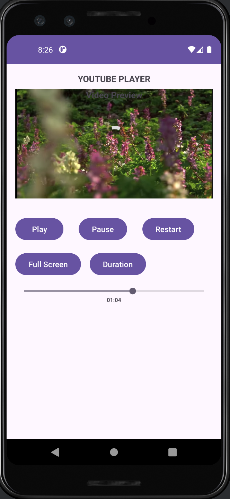
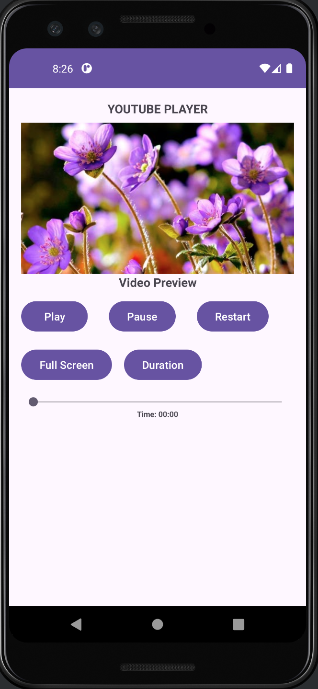

# YouTube Player App

This is an Android application that allows users to play YouTube videos using the YouTube IFrame Player API. The app supports basic playback controls such as play, pause, seek, and restart. It also allows the video to resume from the last position saved in `SharedPreferences` when reopened. The UI includes a video preview and a fullscreen toggle option.

<p align="center">
  
  
</p>

## Features

- Play, pause, and restart video functionality.
- Seek bar to navigate through the video.
- Resumes video from the last saved position when reopened.
- Displays the video duration.
- Fullscreen toggle for an enhanced viewing experience.
- Uses the YouTube IFrame Player API for video playback.
- Saves the current video time in `SharedPreferences` to maintain progress across sessions.

## How It Works

- **Play**: Plays the YouTube video in the WebView using the IFrame API.
- **Pause**: Pauses the video and saves the current playback time.
- **Restart**: Restarts the video from the beginning and resets the saved time.
- **Seek Bar**: Allows users to navigate to a specific point in the video.
- **Fullscreen Toggle**: Switches between fullscreen and normal view.
- **Resume**: When the app is reopened, the video resumes from where it left off, using the saved time from `SharedPreferences`.

## YouTube IFrame API Integration

The YouTube IFrame API is used to control video playback inside a WebView. Here’s how the video is embedded:

```html
<iframe 
    id="player" 
    type="text/html" 
    width="100%" 
    height="100%" 
    src="https://www.youtube.com/embed/ryUxrFUk6MY?enablejsapi=1&controls=0&modestbranding=1&rel=0&autohide=1&autoplay=0" 
    frameborder="0"
    allowfullscreen>
</iframe>
